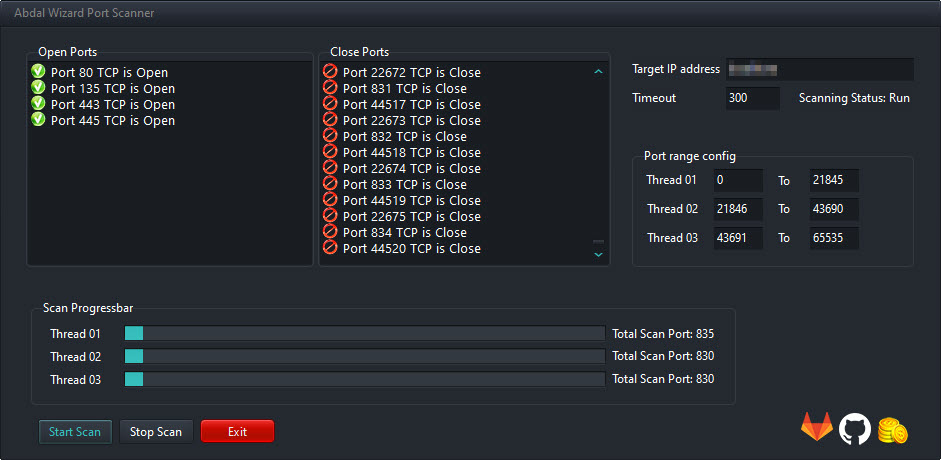

# Abdal Wizard Port Scanner

## Screenshot

## Made For

Abdal Wizard Port Scanner is a free and open-source  for TCP scanning

**Requires**
> Visual Studio 2019 - Telerik WinForm - Chilkat - .NetFramework 4.7.*
>

Features

- Identify All TCP ports
- Zero Fault
- clean code
- No prerequisites
- Beautiful appearance
- installation package
- Multithreading  support
- No malware
- Open Source
- very high speed

## ❤️ Donation
> Donate link: https://donate.abdalagency.ir/

## Reporting Issues 

If you are facing a configuration issue or something is not working as you expected to be, please use the **Abdal.Group@Gmail.Com** or **Prof.Shafiei@Gmail.com** . Issues on GitLab are also welcomed.

### About Programmer
Ebrahim Shafiei (EbraSha) (Ready to cooperate with international projects)
- Email : Prof.Shafiei@Gmail.com

## License
Abdal Wizard Port Scanner is open-source software licensed under the [MIT license.](https://choosealicense.com/licenses/mit/)

## ⚠️ Legal disclaimer ⚠️

Usage of Abdal Wizard Port Scanner for attacking targets without prior mutual consent is illegal. It's the end user's responsibility to obey all applicable local, state and federal laws. Developers assume no liability and are not responsible for any misuse or damage caused by this program.

